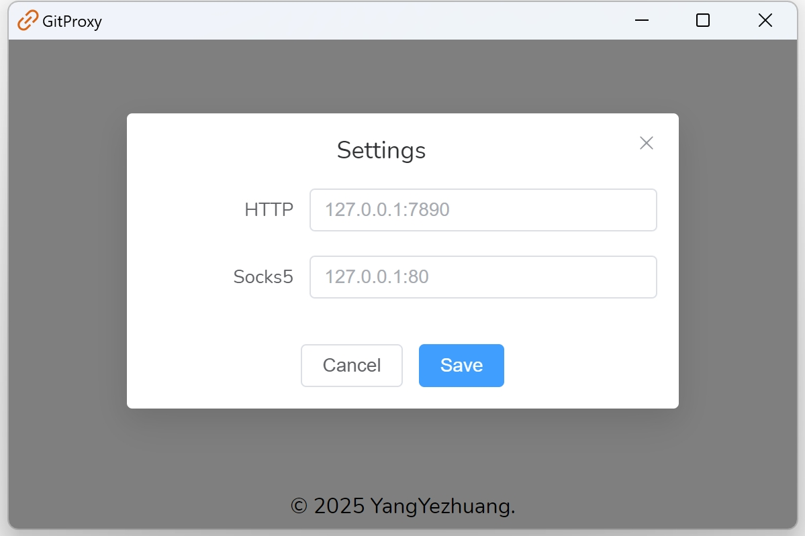

<div align="center">
<a href="https://github.com/yangyezhuang/git-proxy"></a>
</div>
<h1 align="center">GitProxy</h1>
<h4 align="center"><strong>English</strong> | <a href="https://github.com/yangyezhuang/git-proxy/blob/main/README_zh.md">
简体中文</a></h4>


<strong>GitProxy is a modern and lightweight cross platform Git proxy switching desktop client that supports Mac, Windows, and Linux.</strong>
</div>

<picture>
 <source media="(prefers-color-scheme: dark)" srcset="docs/screenshots/light_en1.png">
 <source media="(prefers-color-scheme: light)" srcset="docs/screenshots/light_en1.png">
 
</picture>

<picture>
 <source media="(prefers-color-scheme: dark)" srcset="docs/screenshots/light_en2.png">
 <source media="(prefers-color-scheme: light)" srcset="docs/screenshots/light_en2.png">
 
</picture>


## Build Guidelines

### Prerequisites

* Rust (latest version)
* Node.js >= 16
* NPM >= 9


### Pull the Code

```bash
git clone https://github.com/yangyezhuang/git-proxy --depth=1
```

### Compile and Run

```bash
npm run tauri dev

npm run tauri build
```

## About

If you are also an independent developer (team) and enjoy open source, you can follow us to discuss your experiences, provide feedback, and make friends.

### Sponsor

If this project helpful for you, feel free to buy me a cup of coffee ☕️.

* Wechat Sponsor


